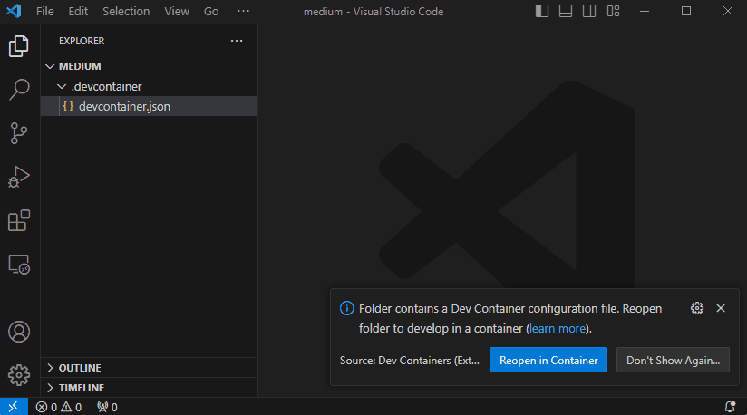

# ROS2 Docker Container

Example ROS2 workspace using docker and devcontainer extension in MS Visual Studio Code.

## Requirements

- [MS Visual Studio Code](https://code.visualstudio.com/)
- VS Code Devcontainer Extension: ms-vscode-remote.remote-containers ([documentation](https://code.visualstudio.com/docs/devcontainers/containers))
- [Docker](https://docs.docker.com/engine/install/)*

*Add user to docker group

```shell
sudo usermod -aG docker $USER
```

### See instruction videos:

Environemnt and IDE stup:
[https://www.loom.com/share/bad2e74256fb4ca9aebc3bb1cd601dcc](https://www.loom.com/share/bad2e74256fb4ca9aebc3bb1cd601dcc)

Password: aishin

### Docker Container Registry (optional)

If you are using a docker registry in Gitlab, you have to login in docker to access the container registry. To login you need a [personal access token](https://docs.gitlab.com/ee/user/profile/personal_access_tokens.html) on Gitlab.

```shell
docker login -p <access-token> gitext.alps.cz:5000
```

## Clone Repository

Clone the repository using SSH - requires to setup SSH keys

```shell
git clone git@gitext.alps.cz:mmwave-radar/ros2-common/ros2_devcontainer_example_ws.git
```

Clone using HTTPS - requires [personal access token](https://docs.gitlab.com/ee/user/profile/personal_access_tokens.html). Use token when you are asked for password. 
```
git clone https://user_name@gitext.alps.cz/mmwave-radar/ros2-common/ros2_devcontainer_example_ws.git
```

# Using devcontainer

Open this repo folder (ROS workspace) in MS Visual Studio Code. Make sure you have installed all required tools!

### Option 1 - Building the devcontainer from MS VS Code.

Use this option if you do not have prebuild docker image either on your machine (see [Build Dockerfile](#build-dockerfile-manually)) or have it available from gitlab container registry.

Open the the .devcontainer/devcontainer.json file and make sure the build config is uncommented ("image" tag has to be commented):

```json
	//"image": "gitext.alps.cz:5000/mmwave-radar/ros2-common/ros2-devcontainer-example-ws/ros2-jazzy:latest",

	// Use build argument to build devcontainer from dockerfile
	"build": {
		"dockerfile": ".Dockerfile",
		"args": {
			"BUILDKIT_INLINE_CACHE": "0"
		}
	},
```

### Option 2 - Use pre-build docke image.

Open the the .devcontainer/devcontainer.json file and make sure the image tag is uncommented ("image" tag has to be commented). If you are logged in docker, the example image will be downloaded from gitlab container registry autmatically.

```json
	"image": "gitext.alps.cz:5000/mmwave-radar/ros2-common/ros2-devcontainer-example-ws/ros2-jazzy:latest",

	// Use build argument to build devcontainer from dockerfile
	//"build": {
	//	"dockerfile": ".Dockerfile",
	//	"args": {
	//		"BUILDKIT_INLINE_CACHE": "0"
	//	}
	//},
```

### Next step

Click on the little blue icon in the left bottom corner of the VS Code window. You will see action options on the top of the window - select Reopen in Container. Ignore the paste step from GIF :)

Open the terminal and just try to run ```ros2``` command - you are ready to ROS and roll!



Now you can build and use your ROS workspace: 
```shell
colcon build
. install/setup.bash
```

## More Info and Best Practice

If you need to customize available tools and ROS packages, see and change the [Dockerfile](.devcontainer/Dockerfile). In general, it is wise to track all the changes in the dockerfile. If you need to install any new tool or package, you can test it by using termin in VS Code - installing via e.g. ```apt update && apt install xxx```. However if you rebuild devcontainer, you lose all the changes! If you add them to Dockerfile, new tool will be automatically included in the docker image when you next time rebuild the devcontainer. 


You can also change the ROS distro in dockerfile. Just make sure you modify all distro-dependent packages as well.

# Build Dockerfile (manually)

You can build dockerfile and create docker image using docker directly:

You may name the image (-t <image_tag>) as you wish. Following is an example using specific tag which allows you to push the docker image into [gitlab container registry](https://docs.gitlab.com/ee/user/packages/container_registry/) for later use. This way you do not need to build the image every time you want to replicate this ros workspace. You rather download already built image from the gitlab and use it.

```shell
docker build -t gitext.alps.cz:5000/mmwave-radar/ros2-common/ros2-devcontainer-example-ws/ros2-jazzy:latest -f .devcontainer/Dockerfile .
```

Use following command to push the docker image to the container registry in gitlab:

(You must be logged in docker registry - see [Requirements](#requirements) section)

```shell
docker push gitext.alps.cz:5000/mmwave-radar/ros2-common/ros2-devcontainer-example-ws/ros2-jazzy:latest
```
